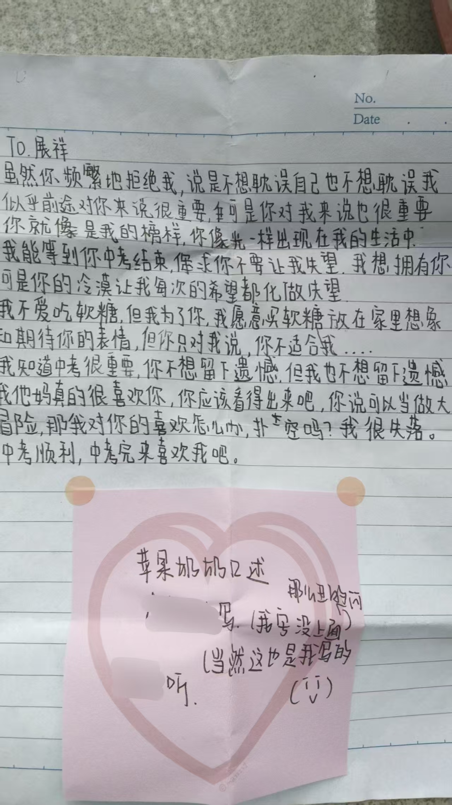
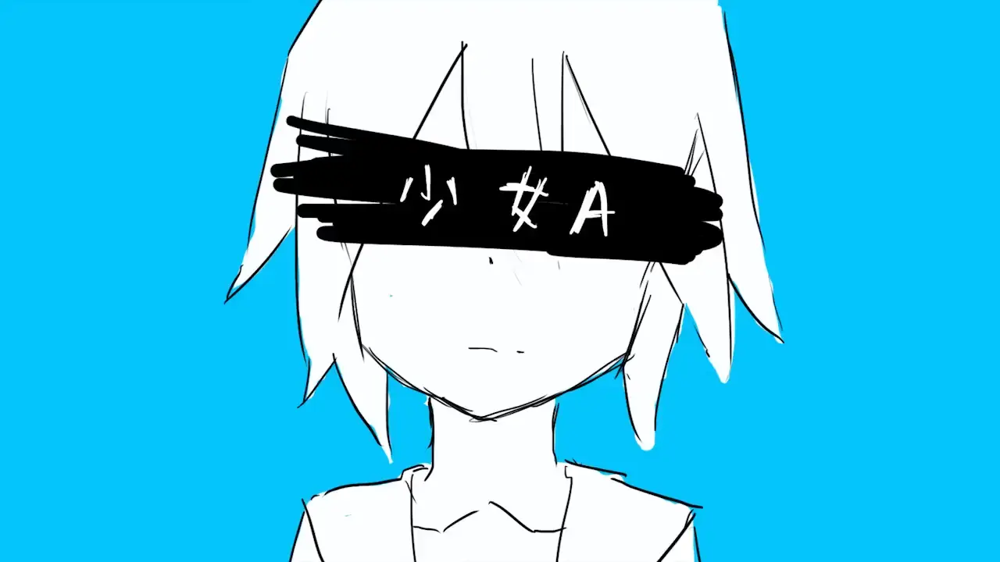

---
title: 我的一个个不成熟
published: 2026-06-17
pinned: false
description: 说说我的往事
tags: [随记]
category: 随记
licenseName: "Unlicensed"
author: 阿獭佧
draft: false
image: ./images/A1整晚.avif

---

封面图片：[《整晚》](https://www.avogado6.com/?lightbox=dataItem-me4d7i1g22)| 作者：アボガド6 (Avogado6)

***

有时我会觉得自己是一个好自私好自私的人

## 苹果奶奶

我不知道我保留着多少小学和初中的记忆，至少现在我回忆起来，幸福的时光会比那些令人难堪的记忆要多的多，可能是我把不好的回忆全都丢掉了？也可能是我真的一直活在一个很好很好的环境里。

那回忆中的我是个怎么样的人呢？现在让我来讲的话，应该会是一个生在豪中不知豪的人吧。

我会用动漫中的台词跟现实中的同学说话，有时说话喜欢双重否定表肯定，总之绕绕的，像个神人。在课余时间用粉笔在黑板上写下喜欢的CP的名字，不时痛苦地捂着脑袋去讲一些听起来让人感觉很黑暗的话，自诩自学了日语但只不过是连五十音图都背不下然后用奇妙的空耳来读一些日语句子。

这样糖分超标的我，既是再快毕业的时候收敛了一些，但仍旧让我不堪回首......然而我却在这时候遇到了让我难忘的事。

在2022年的3月31号，我的同桌跟我说有人想认识我，我完全没有把这件事放在心上，毕竟第二天是愚人节。等到第二天，他跟我说对方约我晚修课间在教学楼某个黑暗的角落见面，不是跟我闹呢！我毫不在乎的赴约了，想想今年愚人节给我整什么活。

这样大大咧咧的我真的遇见了一个青涩而又小心的人，讲真的，天塌了。

后来发生了什么事？完全不精彩。那是一个初一的女孩，对我表达了她的心意，我没有接受。后又在拉扯了一星期，人和事便都慢慢地淡出了我的视野。

我现在常常回望这一件事，即使当时的我没有愧对于自己在意的人，但我常常回想，如果我更加聪明一些、更加活络一些，那事情会不会有不一样的发展呢？那样的改变又会产生怎样的我呢？

## 土匪

我记得在张嘉佳的《从你的全世界路过》中，有一章的题目是“初恋是一个人的兵慌马乱”，看到这句话的同时，我就会想着：那为什么会兵荒马乱呢，大概是遇到了土匪吧。

会这么想，只是这样想了而已，无关初恋、无关人、无关兵也无关马，只是我跳跃的思维把两个事物连接在了一起而已。

在6月9号，我在B站刷到了一个叫做三叶的up主，我很喜欢她的声音，当时我抱着：这家伙以后不会成为像是沃玛那样的人物吧！的心态，找到并加入了她的粉丝闲聊群。我第一次真正的和素不相识的网友建立起了交情。

群里的人们很活跃，我用连我都忘了怎么做到的方式让大家认识了我，也认识了群里的大家，其中包括一位叫做：**东寨土匪头头** 的人。在之后人生第二长的暑假里面，我和群里面认识的相性好的人们拉了个小群，几乎每天都一起玩游戏聊天。而那个群的群主就是**东寨土匪头头**。作为一个不太擅长交际的人，我觉得我在那段时间学到了很多东西，在这之前，我常常沉浸在自己的世界里面，甚至可能不太好和现实世界的人交流。

再往后呢，是一周只能回家不到两天的高中，我像是没被勾住的火车车厢一样，渐渐地落下了与他们的节奏。跟不上他们聊天的话题，也没有足够的情绪在新人和老友面前活动，我累了，于是我告诉自己：高中学习很难很忙很累，我不能在像以前那样无忧无虑的和大家玩了。

其实应该是我不再能从这个群体里得到我想要的能量了吧。我自顾自的认为后又自顾自的离开了。我总是觉得：我错过了这个，我错过了那个，我与土匪擦肩而过，但是是真的是这样吗，还是说只是我不想承认我们已经分道扬镳了？

最后塞一个我最近好喜欢听的音乐

 <audio controls src="/music/少女A.mp3"></audio>

我超级喜欢那个不知道是什么的吹奏乐器，在间奏期间，两个吹奏乐器一起拉起整个歌曲的调，让我感受到好欢快好跃雀的绝望。

