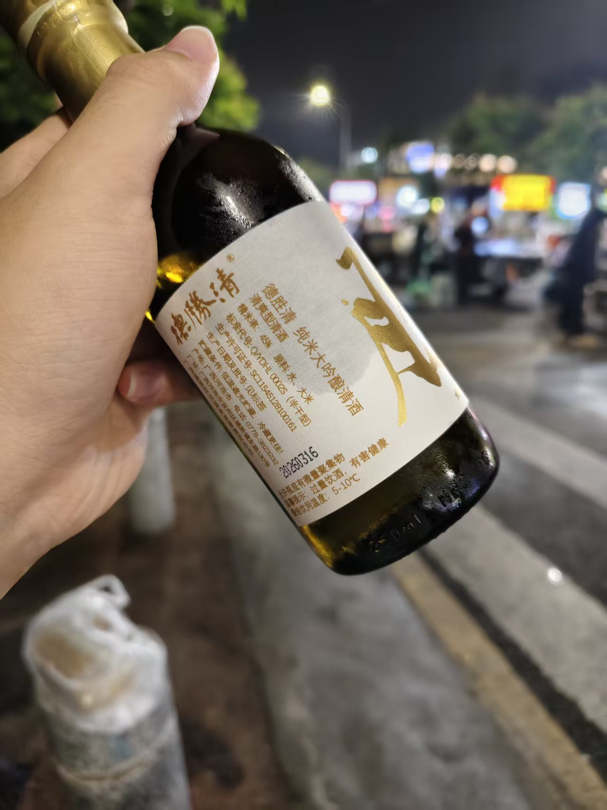

为什么突然想喝酒了呢？因为这个！

这季度超级超级棒的番，小伙我只是不小心看了它一眼便被他深深地俘获了！

推荐所有生活过得压抑的人去看看，谁不想在深夜熄灯后对着荧幕里大胆的角色做出神秘的做法仪式呢😋

***

## 选酒

居然是因为番里的人物起的这份好奇心，那首当其冲的便是试试他们喝的酒是什么滋味吧。蛙趣，一张**涩泽荣一**！（日本货币最大面额10000元上印的人物，大概是四百多人民币）买了这瓶酒的话那我这个月吃啥啊！？可恶啊，只能找下位替代了。

之后我稀里糊涂的刷了好多好多视频、了解清酒的相关知识，下载了境外购物软件、结合了现在各种酒品的热度后......

我选择了京东“搜同款”里几十块一瓶250ml的神秘清酒！虽然很耻辱，但是既没有钱也没有时间还没有知识的我也没办法了，就当抽奖吧。

总之先浪费一点小钱抢先验好吧。

哦吼吼吼吼，这色泽，这瓶身，好平庸啊......

***

## 品尝美味

找了一个酒精过敏的**ケサザケ**来和我一起喝酒。提前把酒放在冰箱里面冰了一会，然后再去便利店买了一些冰块，带着随便的玻璃咖啡杯，我和ケサザケ在宿舍门前的石墩子试试这酒成色。

这酒米白米白的，看是看着就觉得柔和，把鼻子凑上去，能感受到酒精散进你的鼻子里，我提起杯把，小抿了一口......再将酒水含在舌根，我能品到一股鲜甜从嘴里流进鼻子再灌入食道，能觉得差不多后，再将它饮下，感受苦与涩凝聚在你的喉间......还不错嘛，不枉我花费的这几多钱。

拿来下酒的是最近跟菌子一样突然多出来好多的菌子炒饭！顺便买来试吃了，炒的饭倒是一点不差，加的是松茸，吃这菌子的时候，能感受到它在牙齿间散发的能量，啊！这菌子有力气。

（忘记给菌子炒饭拍照了，于是没有配图）

~~也许等暑假回家，我会去霍霍我爸的酒柜了......~~

