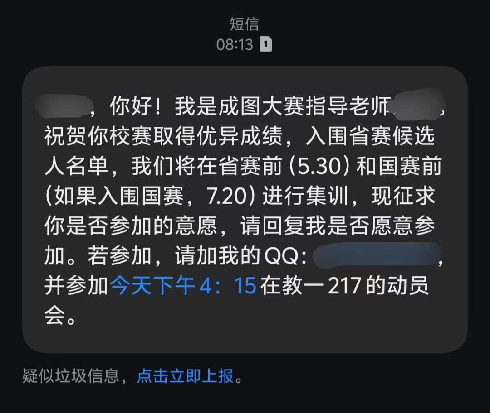
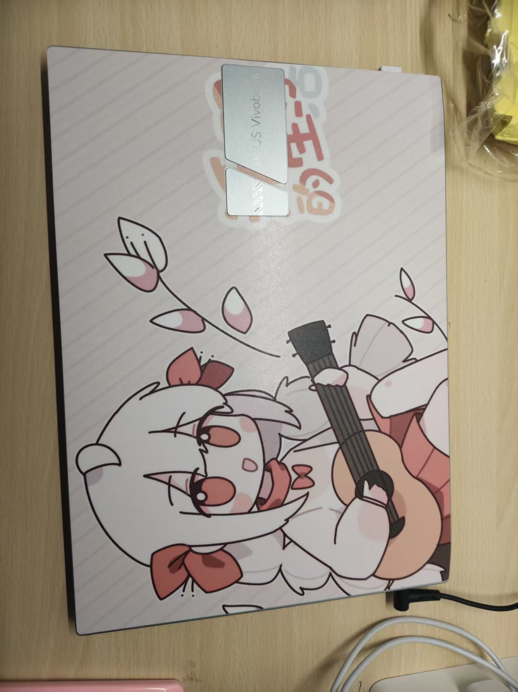

## 成功晋级校队！

在成图大赛的校赛中，我个人取得了综合第三、小队取得了团队第二的成绩，希望我接下来能更加更加的超然脱线呼！

## 寻找笔记本

我有两个笔记本，一本叫aTa,一本叫Ka，我把Ka放在工作室，把aTa带着到处跑。

在21号的晚上，我想拿出aTa刷视频来着，但是居然找不到了！这并不好笑，我的笔记本，不见了！

回忆起昨天上过的课，理论力学...日语...都带了笔记本啊，我到底哪时候丢了呢？

于是在第二天早上，我起了一个大早，去搜索未撤离的笔记本，但让人恐慌的是，两间教室都找了，都没找到！可恶啊，我回到工作室，已经在网上搜索该怎么寻找失踪的笔记本了......

眼看差不多要上课了，我决定还是先去签个到，再想想该怎么办，走着走着正带着耳机听歌呢，耳机突然发出：**蓝牙已连接**的提示，呃，看了看，这不我日语教室吗？没多想，进去仔细找了找......找到了，原来是躲在了抽屉的阴影下，好奇怪啊，这我居然能没找到。

总之，不是被人偷走，没有被人弄坏，就是皆大欢喜了！

最后晒晒我的笔记本吧！

