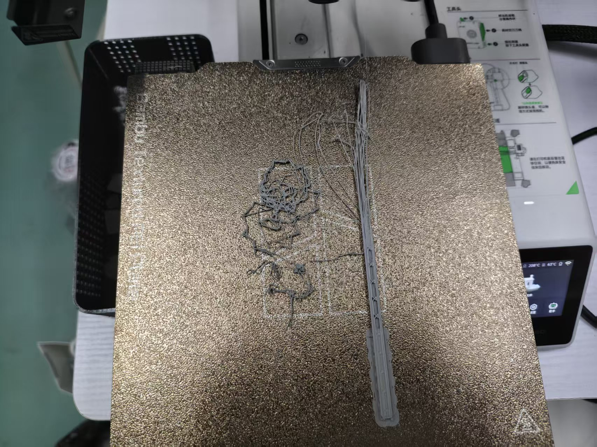
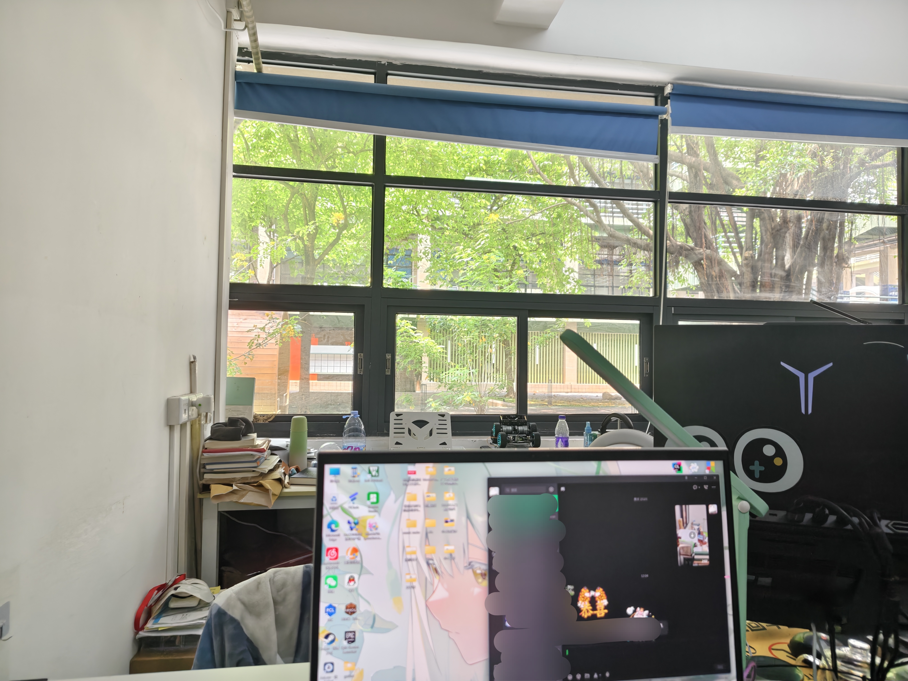

## 增材制造比赛

4月14日，我和MFT结构组组长一起参加了**增材制造比赛**，我受到了邀请，离开了让我积怨已久的宿舍，来到了创谷下C101：独属于MFT的工作室。

比赛的要求是通过3D打印制作一个能完成对、螺丝、螺母、垫片成套分组的设备。

期间我和组长进行赛题沟通，组长主要负责解析命题要求，设计机械结构，而我是完成数字建模，并一同检验模型是否可行。

过程真是颠荡起伏啊，提出、否认、补充、践行、实验、否决、打磨......在距离结赛的最后一小时前完成了赛题的上交。

成品如下图所示

<video controls width="100%">
    <source src="/videos/增材.mp4" type="video/mp4">
  </video>

虽然这个比赛让我和组长周二到周五拼命的干了四天，让我完全没有时间和我的床拥抱，但总体来说，我对这个比赛的全过程还是非常满意的！~~如果最后获奖名次能在一点的话我会更满意的~~

比起比赛为我带来的3D打印经验、或是比赛排名带来的创新分加成，这次经历对我来说收获最大的应该是他人的认可！

如果只讲虚空的认可与称赞，那么我也会不屑一顾，但是在组长的认可下，我受到了担任**2025级MFT微流控队长**的邀请，并且得到了在工作室拥有一个自由的位置的权限。可以说，这改变了我的大学生活呀！在我的大学总结里，这一定会是一个不得不提的时间点，就姑且称其为**转折点一**吧！

## 成图大赛

在完美晋级了成图院赛的选拔后，我继续参加了成图的校赛。

紧接着增材制造比赛完成的下一天，我在连续四天没睡好觉、晚上12点入睡、没有任何闹钟的情况下，第二天八点超绝自然醒来了，之后精神饱满的吃了早餐并稳稳接住九点的绘图考试，这何尝不是一种自信与大心脏呢？

