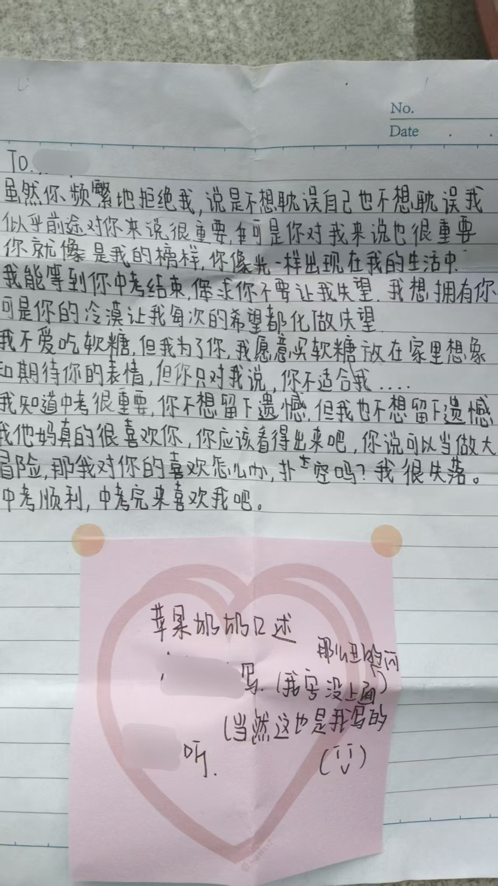

---
title: 临近端午，懒得给自己贴上“忙”的标签了
published: 2026-06-17
pinned: false
description: 说说我的一个坏习惯
tags: [随记]
category: 随记
licenseName: "Unlicensed"
author: 阿獭佧
draft: false
image: ./images/A1整晚.avif

---

封面图片：[《整晚》](https://www.avogado6.com/?lightbox=dataItem-me4d7i1g22)| 作者：アボガド6 (Avogado6)

***

有时我会觉得自己是一个好自私好自私的人

## 苹果奶奶

我不知道我保留着多少小学和初中的记忆，至少现在我回忆起来，幸福的时光会比那些令人难堪的记忆要多的多，可能是我把不好的回忆全都丢掉了，也可能是我真的一直活在一个很好很好的环境里。

那回忆中的我是个怎么样的人呢？现在让我来评价的话，应该会是一个生在豪中不知豪的人吧。

我会用动漫中的台词跟现实中的同学说话，有时说话喜欢双重否定表肯定，总之绕绕的，像个神人。在课余时间用粉笔在黑板上写下喜欢的CP的名字，不是痛苦的捂着脑袋去讲一些听起来让人感觉很黑暗的话，自诩自学日语但只不过是连五十音图都背不下然后用奇妙的空耳来读一些日语句子。

总之，到快要升学的时候，我终于发现了我像个嘉豪的事，并自认为自己发现了自己蠢的无可救药。当然在现在的我看来这个自己也是个笨蛋哟。

我们当时晚修不是强制性的，一栋楼六层三个年级所有参加晚修的同学聚集在二三层，当时初三的我们在二层。5、6层白天是初一的教室，晚上则是关着灯。

在2022年的3月31号，我的同桌跟我说有人想认识我，我完全没有把这件事放在心上，等到第二天，他跟我说对方约我晚修课间在教学楼五层见面，不是跟我闹呢！我毫不在乎的赴约了，想想今年愚人节给我整什么活。

其实也没有说的那么坦然，心里还是紧张的。

后来发生的事看得到我博客的人应该知道。一个初一的女孩对我表达了她的心意，我没有接受。站在现在我的角度来看，我还很假惺惺的在想该怎么安慰她、怎么述说我的考量，既然自己会在意，那么拒绝的时候怎么不找一个好一点的理由呢？中考很忙啊？我们不合适？哈哈哈哈哈

## 土匪

我记得在张嘉佳的《从你的全世界路过》中，有一章的题目是“初恋是一个人的兵慌马乱”，看到这句话的同时，我就会想着：那为什么会兵荒马乱呢，大概是遇到了土匪吧。

会这么想，只是这样想了而已，无关初恋、无关人、无关兵也无关马，只是随心一想罢了。

在6月9号，我在B站刷到了一个叫做三叶的up主，我很喜欢她的声音，当时我抱着：这家伙以后不会成为像是沃玛那样的人物吧！的心态，加入了她的粉丝闲聊群，那是我第一次在网络上面不再是旁观者。

群里的人们很活跃，我用连我都忘了怎么做到的方式让大家认识了我，也认识了群里的大家，其中包括一位叫做：东寨土匪头头 的人。在之后人生第二长的暑假里面，我和群里面认识的相性好的人们拉了个小群，几乎每天都一起玩游戏聊天。而那个群的群主就是东寨土匪头头。作为一个人类，我觉得我在那段时间学到了很多东西，在这之前，我常常沉浸在自己的世界里面，甚至可能不太好和现实世界的人交流。

再往后呢，是一周只能回家不到两天的高中，我像是没被勾住的火车车厢一样，渐渐地落下了与他们的节奏。跟不上他们聊天的话题，也没有足够的时间在新人、老友里面刷去足够的存在感，我好累，于是我告诉自己：高中学习很难很忙很累，我不能在想以前那样无忧无虑的和大家玩了。但是我不甘心，我的情绪就像是一个被堵住的发动机。于是我强烈的渴求在现实中交到朋友，我用自诩的察言观色、距离感接近了一个又一个人，如同小丑一般辗转反侧。

当然啦，高中的生活其实没有那么累、我也不像小丑，只不过是我无处安放的情感在作祟罢了。

到后来，我总是觉得：我错过了这个，我错过了那个，我与土匪擦肩而过，但是是真的是这样吗，还是说只是我不想承认我们根本走在一条不同的路上。

诶诶今天就到这里了，不想写了，放一首最近喜欢听的歌《少女A》

 <audio controls src="./music/椎名もた,鏡音リン - 少女A (feat. 鏡音リン).mp3" />

我超级喜欢那个不知道是什么的吹奏乐器，在间奏期间，两个吹奏乐器拉起整个歌曲的调，让我感受到好欢快好跃雀的绝望。

