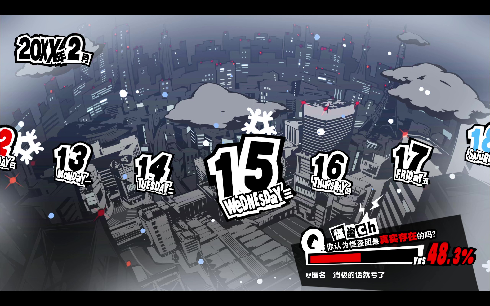
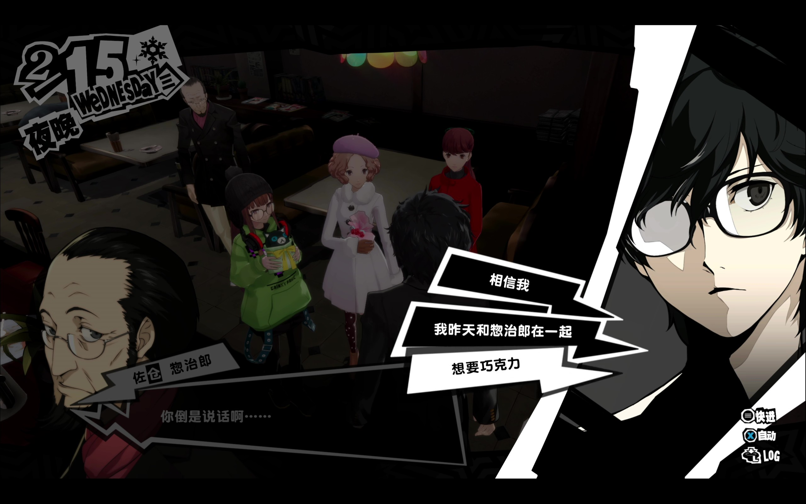
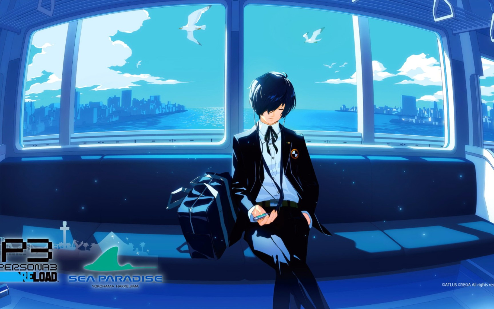

多亏我的朋友**盒子君**的~~steam游戏库~~帮助，我能玩到大名鼎鼎的**女神异闻录5**！说到这游戏，现在最出圈的应该是**星と僕らとremix**吧，我也是玩了会才突然意识到：诶？这音乐好像是这游戏里面的？对哦，如果你还没听过**星と僕らと**的原版，那赶紧去听听吧！我超级喜欢，曲子的情绪超级满溢。

老实说，p5并没有什么让人眼前一脸的剧情，仍旧是老一套的热学王道剧情。也可以说它只不过是优秀的团队在全方面资源的堆砌下搬上来的游戏、画面、音乐都超级厉害的水桶游戏。正因如此，它能从各方面吸引人入坑，不挑受众。

那么对于我来说，最吸引我的果然就是这个音乐啦！

突然涌出那么一坨风格独特的音乐任我享受，那是真享受啊！听着听着，我也接触到了p系列的其他作品。

p5感觉非常优雅、p4感觉非常释然、p3感觉非常流行！总体听下来，最让我喜欢的居然是p3的歌曲呀。正好前几年重制了p3，所以我顺便也去感受感受新时代的作品。

顺带一提，我草鸡喜欢06版的**キミの記憶**，非常非常的喜欢，一定要试着去听听！

 <audio controls src="/music/你的记忆.mp3"></audio>

虽然这个p3r是最近才重制的游戏，但游玩性不比p5r呀，玩起来有点无聊，而且我超级不喜欢这个强制爬塔呀，玩p5的时候我最喜欢的就是到处乱逛，非必要不下宫殿。

但很可惜的是，我边玩边看攻略的时候，不小心被剧透到了游戏结局！可恶啊，瞬间就没有玩下去的动力了，好可惜啊好可惜，我就只有每天听着这个歌来缅怀我逝去的p3青春......

