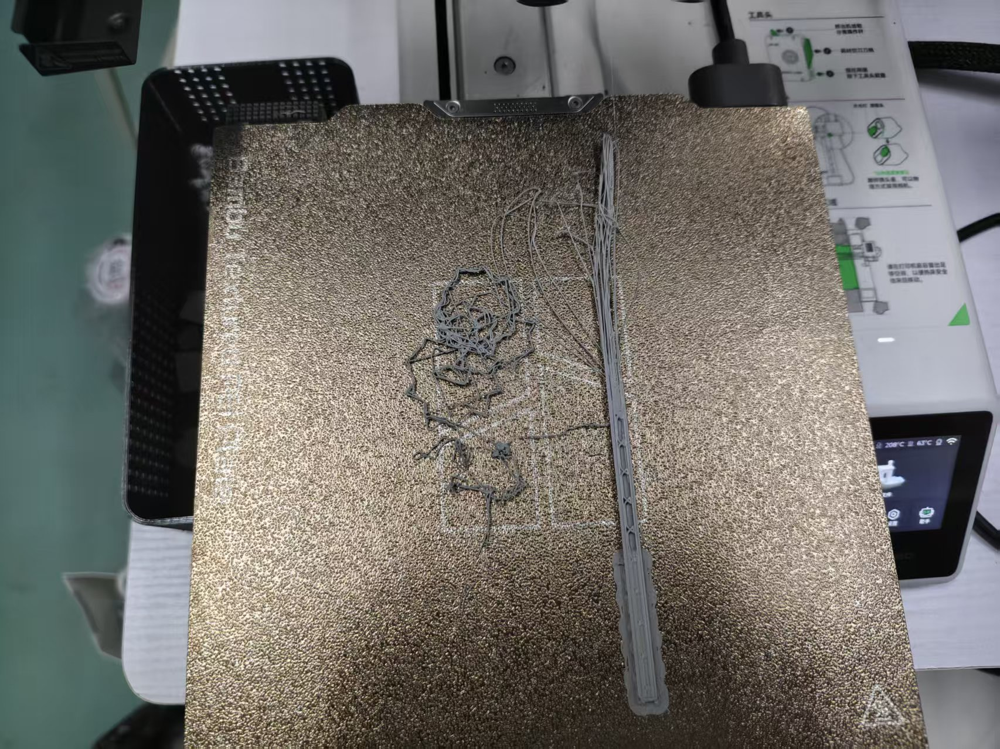

# 关于我一星期三天没睡觉、四天熬大夜、五天打比赛这一档事

***

​	我的天啊，真是社畜体验卡了，上一周真的把我老命给累穿了。

​	先说说我到底干了啥哈~从周二到周五，这四天我要参加一个邪恶的增材制造竞赛，给我们命题要求，让我们用3D打印机给弄出来。

​	哈哈哈哈~我和我的队长两个人吭哧吭哧干了四天，睡觉时间从六点、到七点、到八点，到最后一天十一点提交压缩包，我和我宿舍的床就跟离异了一样，我觉得这一定不是我们的问题，我的组长已经努力在设计方案了，我建模都建冒烟了，而且用上了我们雄厚的人脉资源，并用三台高端打印机，才堪堪在比赛结束前一个小时完成比赛内容......虽然我参加之前不怎么看中名次的，但是你最好别给我甩个三等奖就走！！！

​	但是~我感觉我已经收获到了能和我的付出相抵的成果。首先呢！没错，我在MFT有个家了！（bushi，总之就是趁着比赛搬进了工作室，结果可以赖在里面不走了。当然我原本也是没有那么厚颜无耻的，溯源来说呢是在比赛第二天晚上，我们休息整备的时候，我的队长也是我们上一届的团队组长透露了她想委任我为下一届的组长的意愿...我从来没有觉得加入MFT微流控不开心过！理所当然的答应了。到后面有一天，我在工作室里面听到了有老资历对于我在这筑巢表示疑问，我当时已经想好了如丧家犬般的我该以一副怎样落寞的模样遗憾退场的场景，结果组长贴心的跟他们解释了我的身份，大家就没什么意见了。哇塞，这就是身份的力量吗！

​	下一个，就是在刚打完比赛的下一天无缝衔接起来的高教杯校赛选拔赛，当天的我在凌晨一点终于和心心念念的大床缠绵在了一起，异变突生！我秒睡了，直到第二天，听着鸟叫声，我醒了.......完蛋了！！！我居然睡到自然醒了，这意味着，现在手机上的时间可以是12点、2点甚至是下午六点！恍惚了，紧张的气氛连着我的心跳都停了下来，我摸索出枕头下的手机，荧屏上大大显示着：08:01。

​	哦呀，看起来，是天意呀，我完美的在比赛时间九点的前一个小时八点起来了，甚至说是，精神饱满的睡醒了，状态之良好，让我觉得我能横扫考场。后面就是正常的九点到十一点，两点到五点，至于结果，现在还没出，但是要让我吹水的说的话，我计算机建模肯定离满分差不了多少，手绘在不考虑好不好看的情况下也算是完成了所有内容，应该能拿第一吧？算了那都不重要，这次能进校队就满足了，反正以后还有省赛国赛等我蒸。

​	还有一个什么？欧，是小A的二面。为什么一个面试题能让我单独出来讲？因为他宝贝的，我的题目和其他人的不一样，小A专门拉了一个小群，三个学长对接我一个学生，甩来一坨资料，全是一些晦涩难懂的东西，通篇看下来，大抵是要“创新”。后面我才知道，那是他们团队工创赛项目的相关内容，虽然从旁人的角度上：“哇塞！你是说他们对一个还在面试的人提前让他接手项目内容，并以此为考核目标，并且只有他一个？那不稳了吗！”至少我身边的人都是这么认为的，但是对我来说，难办是真的难办啊，无从下手这一块，但应该......能解决，我相信自己！

​	说到这，就提到这一周的总体收获了，除了最物质的工位收获之外，还有就是，更自信了！导致自信的根本是，我发现我好强！打比赛也好，合作也好，我都能很好的完成内容；另一方面，工作室这一块地方，就是能遇到很多的能人志士，这几天我跟同年级的他们接触的更多了一些，了解的更多了一些，也算是打破了些许信息壁垒，大大滴好呀。

​	接下来的几天我应该还会继续泡在教学楼五到三之间的C111MFT里面，欢迎大家来讨伐我喵，谢谢喵。

​	
