***

 

 

### 引言

承接之前院赛校赛省赛，一路晋级过来的我在7月21日将要去荆州的长江大学参加高教杯成图大赛的国赛了。

虽然要我说感觉不到什么意外，但还是会有那种心潮澎湃的感觉啊！接下来迎接我的，将要是公费旅游、路费吃饭吗？

### 赛前颠簸

与我想象中的不同，这次出去比赛，报销是有额度的，在交通费上来回仅有330块人民币的报销，这无疑是令我难过的，荆州是在武汉旁边一点、湖北的城市，光是坐火车就要六百多的车费，更别奢想高铁飞机了。这真的令我很难过......

在赴往参加比赛之前，我们校队组织了八天的高强度集训。地狱集训！我总是这样称呼这段时间。我无法想象，在度过了高三之后，我还会有一段日子经历8:30~12:00、2:30~5:30、7:00~10:00持续高强度的无间歇练习，阿獭我是个软脚兽，仅坚持了前面四天的训练，后面几天从只去签到到去都不去集训室，真心祝福连续八天努力的人，你们干什么都会成功的，国奖是属于你们的（bushi

还有，隔壁是RM（机甲大师）的训练场所，每次路过的时候都好羡慕，他们能为自己所热爱的东西去奋斗。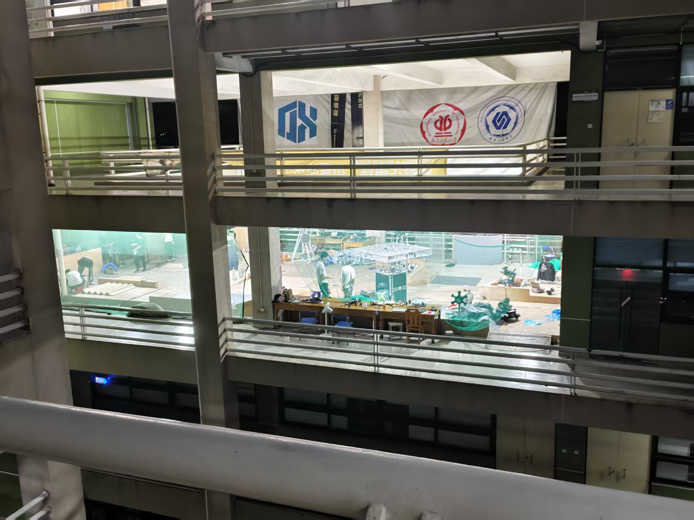

总之，在各种事情的裹挟下，时间比想象中流动的要快得多，还没好好做些什么，就到了要去参加比赛的日子。

### 荆州—移动

7月19日，为了防止睡过头而没睡的我，提着大包小包在六点钟打车去了白云火车站。从前我对白云很憧憬，现在也是，但我没看清过它，它却不多时的凝视着我。我坐上了前往荆州的长达12个小时的硬座。

此刻，造成整个旅途最大的损失，我的蓝牙耳机仓大抵是落在了到白云火车站的出租车上，可悲可叹、可悲可叹.......

<video controls width="100%">
    <source src="/videos/出租车.mp4" type="video/mp4">
  </video>

火车硬座显然是个颇具话题的属性。非常巧，与我同行的5位同学的座位都分在了一起。狭小的座位放不下大大小小包，大家抱着自己最大的包，意图通过补觉度过漫漫长途的第一部分。

作为整个旅途过程中精神最仿徨的时间段，注意力超级溃散！但也有一些想吐槽的东西，比如说，为什么禁烟车厢上的烟味怎么大呢？

<video controls width="100%">
    <source src="/videos/禁烟.mp4" type="video/mp4">
  </video>

 哦对了，还有一对比较神秘的情侣，网上说说的了，谁不想在现实里面有一个能叫妈妈的情侣呢？（bushi，总之是一对超级神奇的情侣，前半段时间里一直在被他们不羞不躁的秀恩爱......

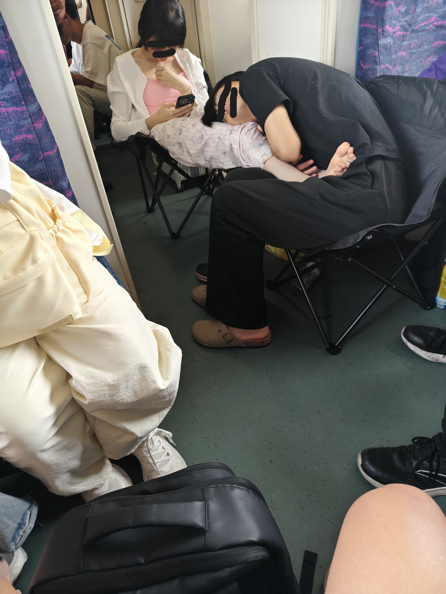

车程的后半段，我基本都是低着头看地板数有多少个黑点，有一个大腿白嫩的人站在了我的旁边，我侧眼瞄去，是一位打扮很时尚的人。抱着这样的想法没多长，就听到了他开腔......我的妈呀！就是那种很经典的“男闺蜜”、“国服杨玉环”懂吗？太典了，我一开始真以为网上是刻板印象来着，没想到现实这么真实的。后面他抱怨绿皮火车的环境：我的妈呀~！下次我再~也不坐绿皮火车了......太典了，这腔调。

### 荆州—到着

当我打开高德地图后，我才意识到我已经离开了广东好远。呃，很没见识的说，这是我第一次离开广东这么远

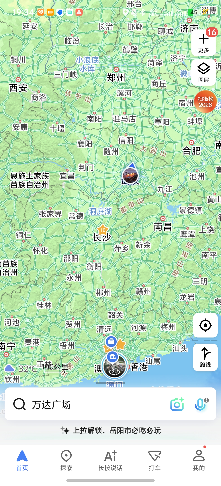

从白天八点半上车，再从武汉站下车后，又坐地铁两个小时，再转车两个小时，终于到了荆州，打开表，已经晚上十一点多了。

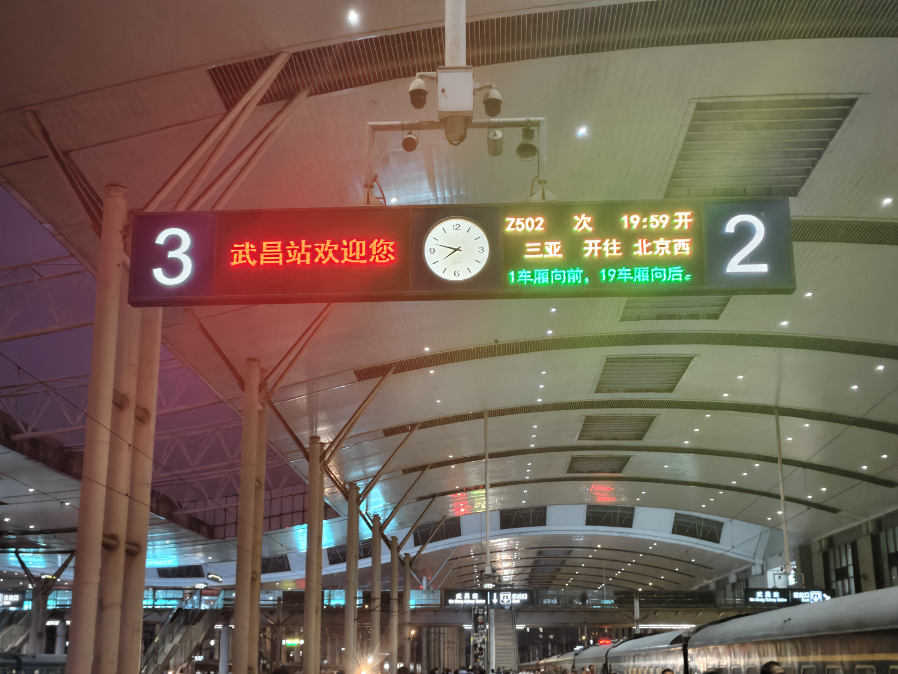

又叫了一个滴滴，来到了长江大学，在里面兜兜转转了好久才找到我们的宿舍，哎哟喂~！真的是累死累死了，接下来到了激动人心的时刻！看看环境~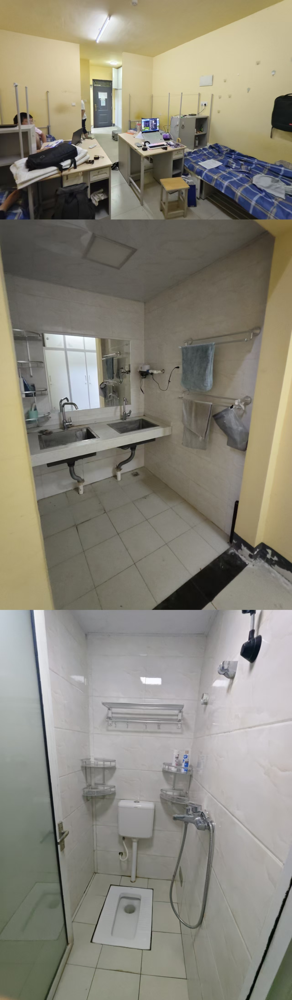

和广工的宿舍比起来真的是超级大诶，虽然是抽象的下床下桌布局，但无垠的空间弥补了这一点，看着这样美丽的宿舍，脚步也没那么沉重了......当然首要任务还是去找点饭吃，毕竟这一天都没吃饭，已经，要变成饿死鬼了......

即便如此，在超级路痴队长的带领下，我们还是兜兜转转转转转转了半个小时，才终于找到宿舍的出口！后又对着围墙使用了 **翻墙**，才终于见到新鲜的美食......

是锅盔！超级好吃的诶。

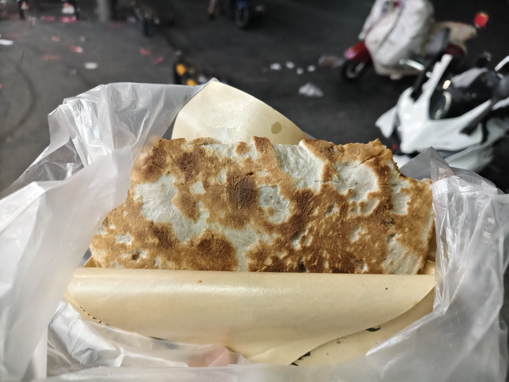

除了锅盔外再买了点芋泥波波、炒面、煎饺子、炸物、甜点，终于吃饱力！（大胃袋最新力证）

吃饱了之后，我们去了一趟零食店，来买一些生活用品......(我知道很抽象，但别问，问就是百货店关门了)

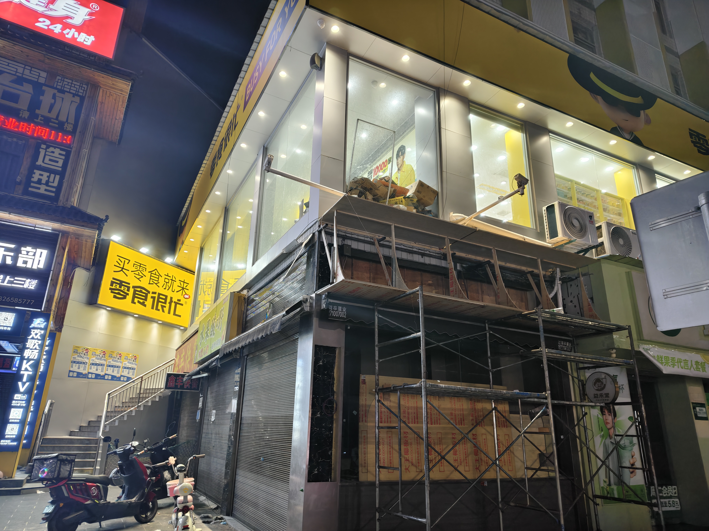

我带的日用品很全，没什么需要补买的东西，只买了一些酒和下酒菜，结账的时候，已经是凌晨一点了，看着眼前的结账员，我想的是：莫非她从早班一直上到了现在？于是饱含情感的说了一句：辛苦你了。结账员很意外，突兀的抬头看了我一眼。

**感觉不知不觉间，我变得比我想象中的要温柔了一点**

虽然我并不能为他们的生活带来什么物质的帮助，但我还是会尽我所能的为他们声援一些什么......

当晚，没什么其他的事，于是趁着胃里还有一些空间，就试一试感兴趣的梅酒，めっちゃ好喝！每次喝完胃都暖暖的，舒服啊！真希望每天晚上都能想这样好好犒劳自己。

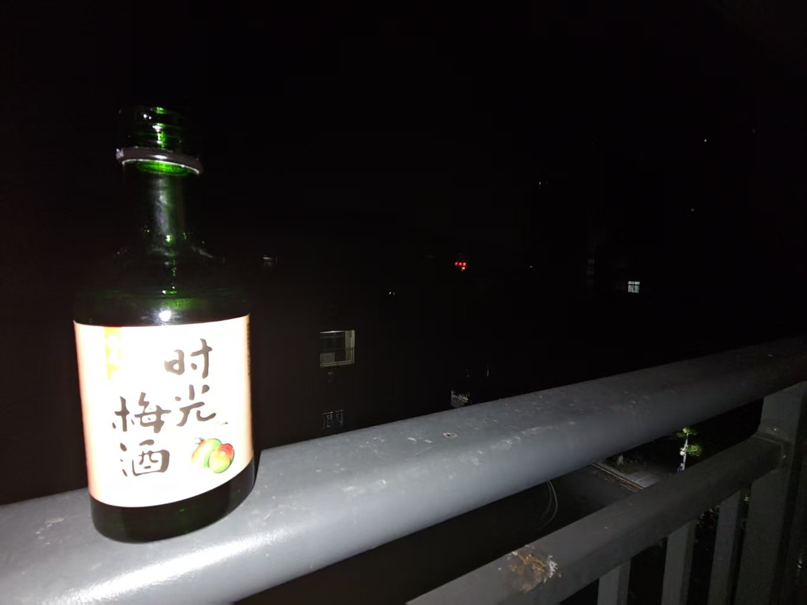

### 一个没什么故事的城市

在我看来，荆州这个城市除了很大意的失去了关羽之外，没什么其他的故事了。走在路上，突出的感觉到路上来来往往的人们年纪都不小，感觉是一个人口老龄化的城市呀。

早上先去领了一下参赛证和饭票什么的，虽说没有在学校食堂吃饭的打算，但有总比没有好。我超级在意这种参赛证的，可惜这上面没有写我的名字，不然我就可以拿来好好吹嘘一番了~

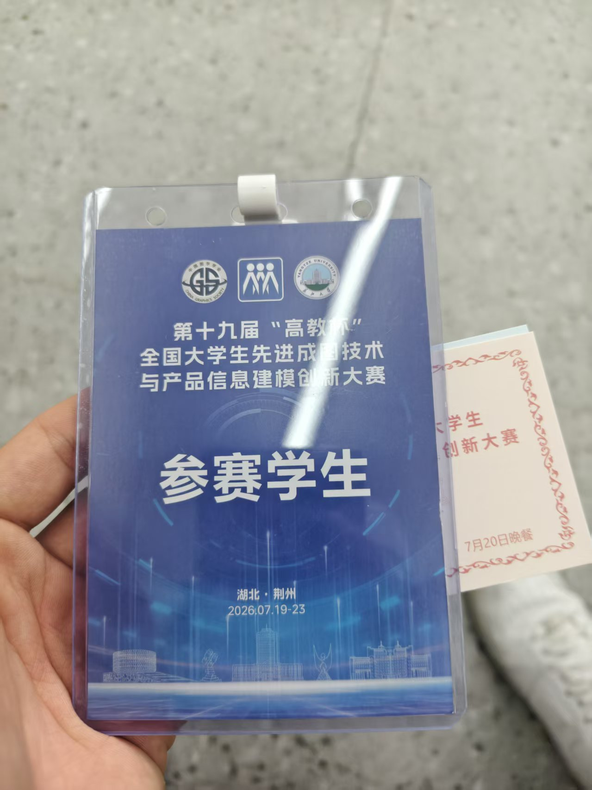

领完材料后，还有模拟考场环节，依旧带着超级重的电脑来到预设的位置，进行电源、网络测试......值得一提的说，这网络超级好啊！平均46MB/S，不懂就问，这是多少兆网络？

跳转到下午，最黄金的时间，我要吃上最豪华的一餐！

首先点了美美两杯啤酒，一杯是我的，另一杯还是我的~

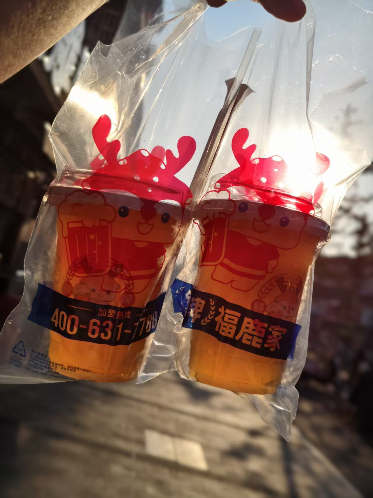

之后是学姐推荐的大锅美食，超级的香呀~依旧猛猛干饭了，

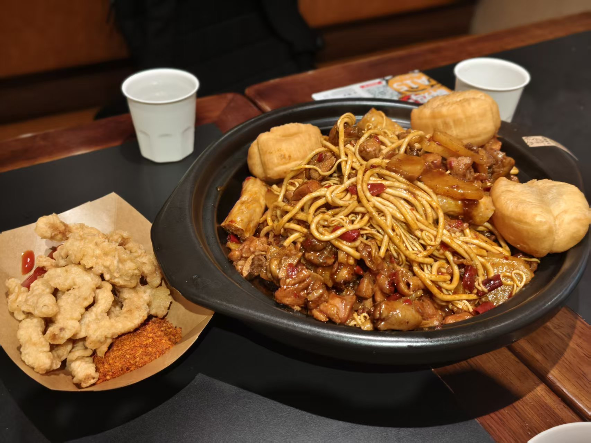

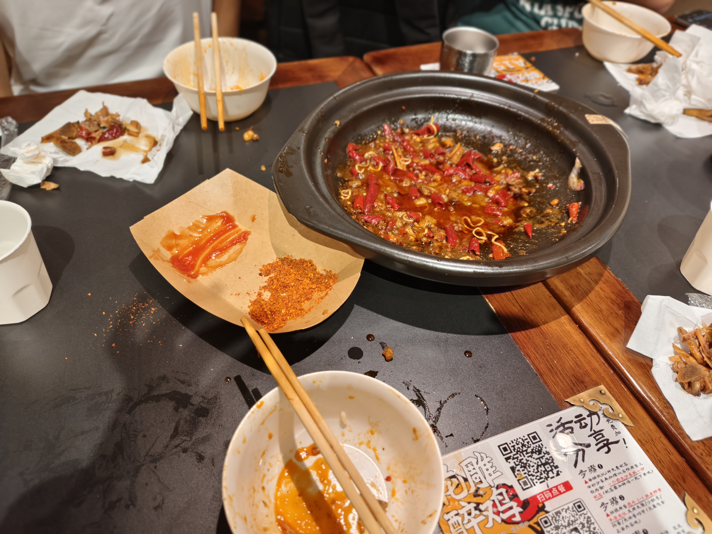

吃完后也没有什么干其他事的心情了，毕竟明早六点就要起床，于是乎我几乎什么都没干，早早地十一点就睡过去了......

### 超级不妙的考试过程

起了一个大早！六点准时起床了，草草的吃完了早饭，再回去稍稍睡了个回笼觉，就到了要考试的时间了，最后，和班长队长老师拍了些合照，希望出成绩后我还能笑得这么灿烂。

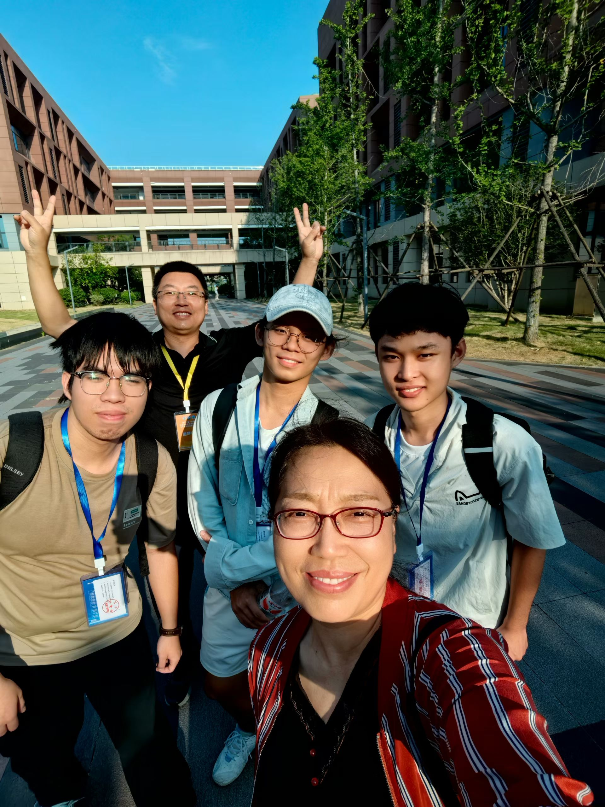

到了考场，进入了超级紧张的竞赛时间！

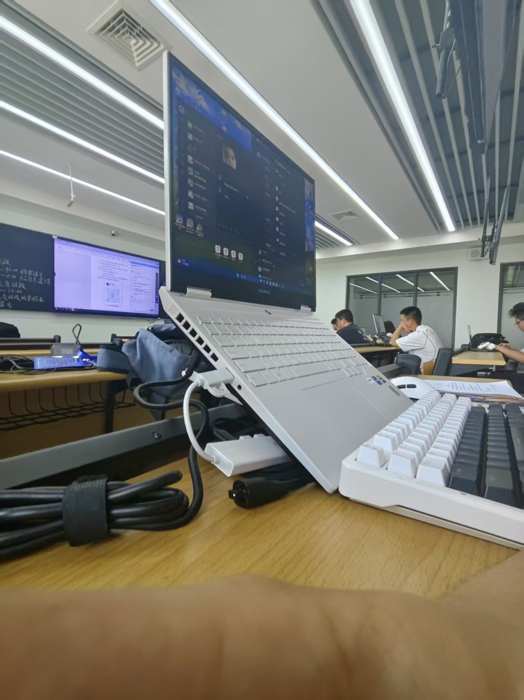

其实感觉这一届国赛的题目难度不大，发下卷子通篇看完一遍后，我都觉得这次是来享受的了，特别是被称为“卡”伦特的卡伦特居然不卡了！

但结果还是问题频出......

坐在我后座的那位人类，让我感觉超级不爽。

我们的靠背连接着他们的桌子，他动静好大，不爽；

他用的是超绝段落青轴？动静好大，不爽；

他怎么老是举手问老师问题，吵到我眼睛了，不爽；

......从考试开始到现在，怎么一直有一个大果的味道啊喂！还有超级超级大声的吧唧嘴，嚼大果也有吧唧声的吗？超级不爽！！！

顶着诸多不适，竞赛时间过去了一半，咔嚓、突然黑了起来，我心一顿，完，停电来了。我知道的，往年的环境停电都是不得不品的环节，我也知道的，我的笔记本电脑不接电完全运行不了，但是，还是好绝望，懂我鼠标2s一帧的折磨吗？看着大家仅仅是帧率下降了一些，而我像是无能的丈夫一样。

在大果大果嚼嚼嚼声音下，我度过了最漫长的二十分钟——

迎来转机的是可以去备电室接电，我带着最重要的东西，贴地飞行过去，可恶！怎么门是锁着的！我在地上爬来爬去，把绿色的安全出口的接口拔下来，趴在地上继续进行建模，等门开后，又从地上爬起来到备电室里面继续建模，因为出现这样的停电情况，考试时间延长了半小时，我第一次顶着身体耐力不足的感受，继续建模，狼狈的坚持到了竞赛结束.......

终于，结束了啊

***

这次真的是拖着疲惫的身体，回到了宿舍。本来想着下午到武汉，有一点时间能逛逛的，但已经完全没有心情了。

这时，想想前面没有花出去的饭票，那不就亏了吗？学校好像早就想到了一样，中午进了一大批饮料，并开放了饭票换饮料的机制......呃，虽然换了饮料后感觉没那么亏了，但是好重啊！一个票能换三瓶，带这9瓶500ml的饮料负重前行吗！你这家伙，真是顽强呢。

回到宿舍后，躺在床上，不知不觉时间就流光了......

### 荆州—离别

没有什么特别的仪式，我和其他同学一同离开了荆州，离开了这个我第一次参加大型竞赛的地方。

接下来迎接我的，是**阔别已久**的卧铺！

呃啊！真糟糕啊！卧铺并没有想象中那么美好。

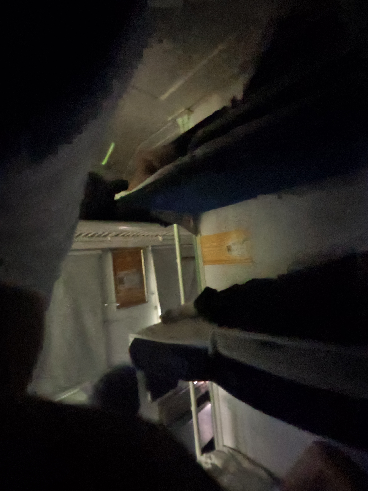

在层高80cm的空间里，我蜷缩着身子，隔壁散出来的烟熏着我眼睛疼，异样的酸臭味刺激着我，如雷的鼾声让我久久不能入眠......这是地狱吗？

**我好心疼我买卧铺的钱**

后来又经历了车厢停空调，面对这样的恶劣情况，我只好搬到了班长的车厢去。离开了8号车厢，才发现外面根本没有什么凶恶！什么叫做你旁边都是香香软软的，我这里上下左右全是老爷，老大爷！伤心了呜呜呜

彼时已经困意全无，便眺望着外面的景色

<video controls width="100%">
    <source src="/videos/外景.mp4" type="video/mp4">
  </video>

是回家的方向~

<video controls width="100%">
    <source src="/videos/白云.mp4" type="video/mp4">
  </video>

最后的最后，再次忍受了广州电车司机超强的风琴演绎技术下（动量回收风琴脚）我终于回到了我出发的地方，广工。

至此，我的第一趟旅行结束了，不知这趟旅途中，我有没有留下什么遗憾？就算有，也要等以后的我去感受了吧。

那就，下次再见吧。

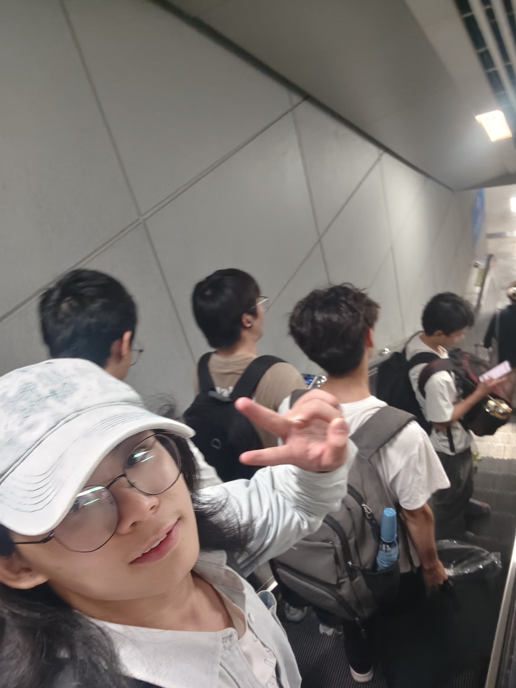
