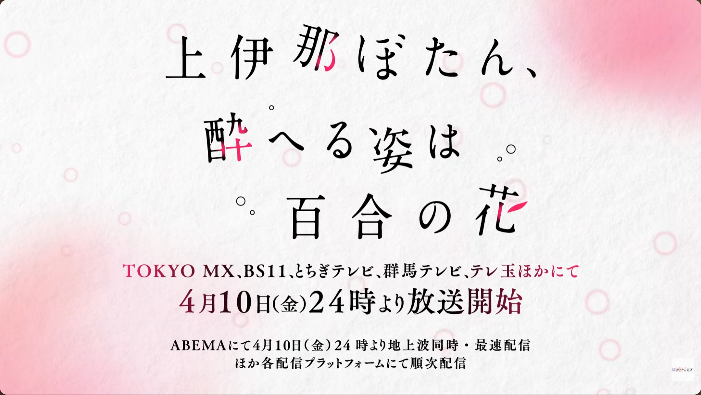
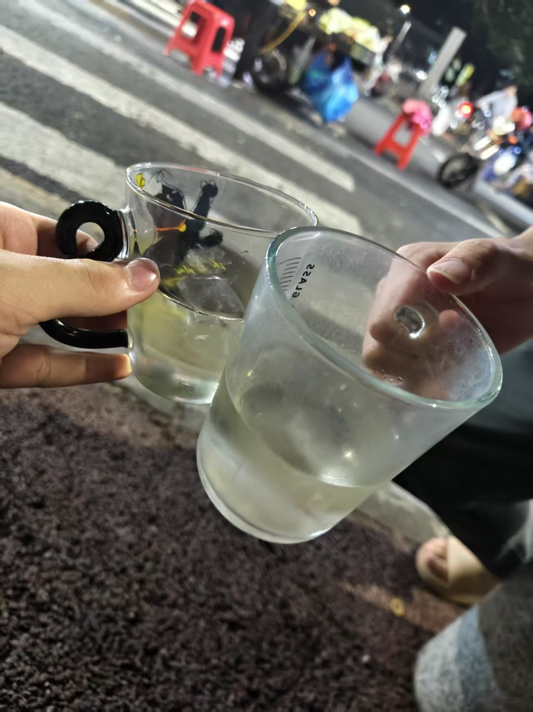

# 浅尝日本清酒

## 为什么突然说到这茬

这季度超级超级棒的番，小伙只是不小心看了它一眼便被他深深地俘获了，手握香烟与美酒，根本停不下来！

推荐所有生活过得压抑的人去看看，谁不想在深夜熄灯后对着荧幕里的大胆的角色做出神秘的做法仪式呢😋

诶呀诶呀，就是这时间点，本来就饿得不得了，而且看着她们喝酒的样子真的好爽啊！好过分啊，太过分了，我也要喝，我也要！

烟就算了，先不说能不能喜欢，喜欢上了估计也不会太舒服......

也许需要其他的契机了？

***

## 选酒

居然是因为番里的人物起的这份好奇心，那我肯定要喝同款酒啦！

蛙趣！一张**涩泽荣一**！（日本货币最大面额10000元上印的人物，大概是四百多人民币）买了的话我这个月吃啥啊！？

最后结合搜罗了B站的推荐、了解了清酒的相关知识，下载了境外购物软件、结合了现在各种酒品的热度后......

我选择了“搜同款”里几十块一瓶250ml的神秘清酒。没办法啊，太贵了，追求太多我还怎么过活啊！

总之先浪费一点小钱抢先验好吧。

***

## 品尝美味

我提前冰了酒，还买来了冰块，坐在这种路口的石墩子上丝毫不怕阻碍交通的品尝了起来。

这酒米白米白的，看是看着就觉得柔和，把鼻子凑上去，能感受到酒精散进你的鼻子里，我提起杯把，小抿了一口......

将酒水含在舌根，我能品到一股鲜甜从嘴里流进鼻子再灌入食道，能觉得差不多后，再将它饮下，感受苦与涩凝聚在你的喉间......

还不错嘛，但应该不会是我愿意花大几百去体验的东西。

所以，我回家后可能要霍霍我爸的大酒柜！

顺带一提，这次还把很好奇的君子炒饭！（菌子）给买来试吃了，炒的饭倒是一点不差，吃的是松茸和一个名字里带绿的家伙，总的感受下来就是：这菌子有力气！那种很特殊的菌子在齿间迸发能量的感觉，说成人话就是发热啦。但很可惜单价太贵了，以后也不会再去尝试了。

（最近这菌子炒饭怎么跟菌子一样野蛮生长啊）